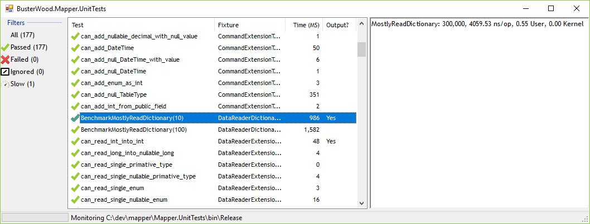

# TestRunner
Continuous test runner for NUnit 2 and 3

# test.exe and testx64.exe

```
test.exe assembly
```

Runs all `Nunit` 2 and 3 tests found the assembly.

Supports:
* `[TestFixture]` attruibute at the class level
* `[Test]` attruibute
* `[TestCase(...)]` attruibute
* `[Setup]` attruibute
* `[TearDown]` attruibute
* `[Timeout]` attruibute on methods and the class level

Test results are output to StdOut, information is returned on StdErr.
Note that other properties of the `Test` and `TestCase` attribuites are **not** supported, e.g `ExpectException`, `ExceptionMessage`.

# testd.exe

```
testd.exe [--x64] assembly
```

Monitors the *current directory* for changes to dll and exe files, and runs tests (via `test.exe`or `testx64.exe`) when changes are found.

# TestGui.exe

```
TestGui.exe [--x64] assembly
```

Uses `testd.exe` to monitor the *current directory* for changes to dll and exe files, and runs tests (via `test.exe`or `testx64.exe`) when changes are found.



## Why

I don't want to pay to a test runner (e.g. NCrunch) when I can build a simple one myself.
